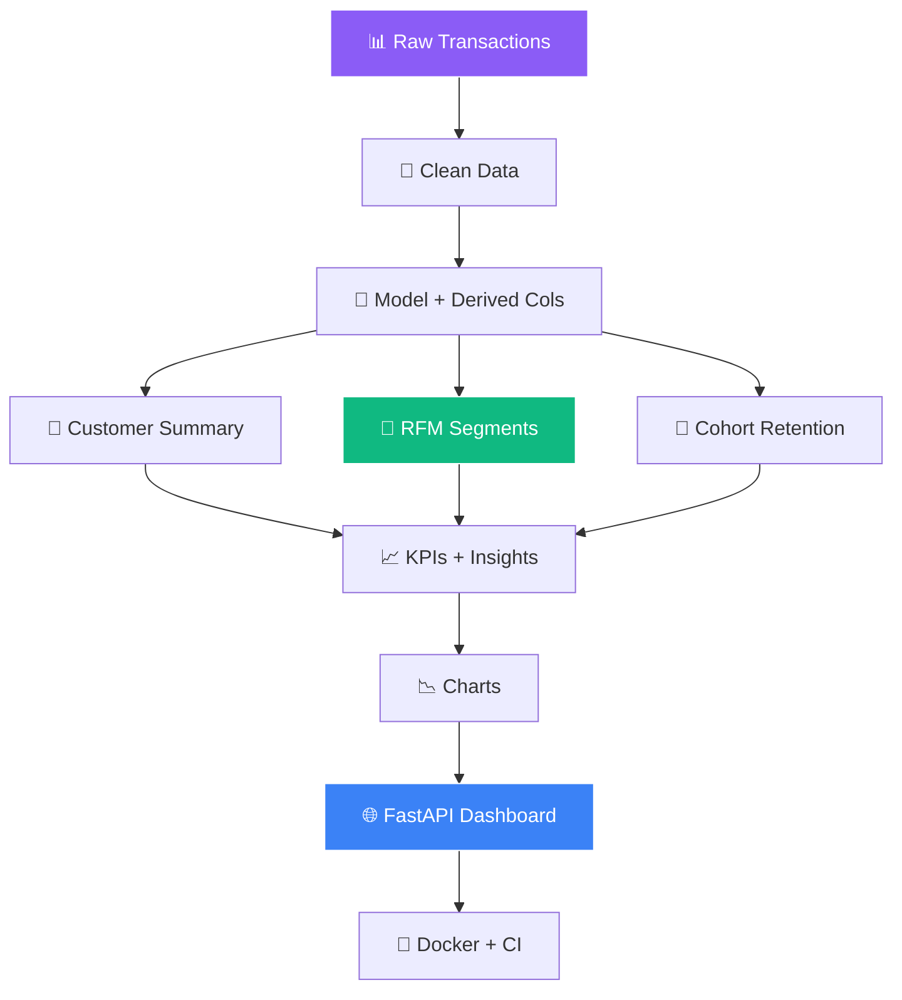

<!-- ═══════════════════════════════════════════════════════════════ -->
<!-- 📊 E-commerce Analytics — Neural Network + AI Animated README -->
<!-- ═══════════════════════════════════════════════════════════════ -->

<!-- ═══════ NEURAL NETWORK ANIMATED HEADER ═══════ -->
<div align="center">
  
</div>

<!-- ═══════ AI MASCOTS — Neural Network Vibe ═══════ -->
<div align="center">
  
  
  
  
  
</div>

<br/>

<!-- ═══════ NEURAL NETWORK TERMINAL TYPEWRITER ═══════ -->
<div align="center">
  
</div>

<br/>

<!-- ═══════ AI SCENES — 8D Cinematic ═══════ -->
<div align="center">
  
  
  
</div>

<br/>

<!-- ═══════ LIVE BADGES ═══════ -->
<div align="center">
  <a href="https://github.com/sumit966/ecommerce-analytics/stargazers">
    
  </a>
  <a href="https://github.com/sumit966/ecommerce-analytics/network/members">
    
  </a>
  <a href="https://github.com/sumit966/ecommerce-analytics/issues">
    
  </a>
  <a href="https://github.com/sumit966/ecommerce-analytics/commits/main">
    
  </a>
</div>

<br/>

<div align="center">
  
  
  
  
  
  
</div>

<br/>

<div align="center">
  
  
  
  
</div>

<br/>

<div align="center">
  <i>📊 Data Analytics Project · Author: <b>Sumit Raj</b> · M.Tech VNIT Nagpur · Ex-Salesforce</i>
</div>

<br/>


---

## 🎯 Overview


This project walks through the **full analytics lifecycle** on a realistic e-commerce dataset:

<table>
<tr>
<td width="25%" align="center">

### 1️⃣ Generate


Synthetic transactions

</td>
<td width="25%" align="center">

### 2️⃣ Clean


Analysis-ready table

</td>
<td width="25%" align="center">

### 3️⃣ Segment


5 customer segments

</td>
<td width="25%" align="center">

### 4️⃣ Serve


Dashboard endpoints

</td>
</tr>
</table>

> **🎯 Purpose:** Turn raw transactions into **actionable business insights** — revenue drivers, churn risk, growth trends.

---

## ❌ Problem Statement

E-commerce businesses generate **huge volumes** of transaction data but struggle to answer **basic questions**:

| ❌ Question | Impact |
|------------|--------|
| 🎯 Which customers drive most revenue? | Can't focus retention spend |
| ⚠️ Which are about to churn? | Losing revenue silently |
| 📈 Which categories/countries are growing? | Missing expansion opportunities |
| 🔄 Are repeat buyers increasing? | No signal on product-market fit |
| 💰 Where should retention budget go? | Wasted spend |

> **Raw data alone doesn't answer these. Structured analysis does.**

---

## ✅ Solution

A **reproducible analytics pipeline** that:

- 🧹 **Cleans and models** 50K+ transactions into one table
- 🎯 **Computes RFM scores** for every customer (1-5 each dimension)
- 📊 **Classifies customers** into 5 actionable segments
- 📅 **Tracks monthly cohort retention**
- 📈 **Produces KPIs** and a written insights report
- 🌐 **Serves all results** over HTTP for dashboards

---

## 🏗️ Architecture

### 🧠 Analytics Pipeline Flow



### 📐 ASCII Fallback

```
Raw Transactions (50K+)
         |
         v
Data Cleaning (duplicates, nulls, invalid rows)
         |
         v
Model + Derived Columns (year, month, quarter, day)
         |
         v
+--------+--------+--------+
|                 |        |
Customer Summary  RFM      Cohort
(per customer)   (segments) (retention)
|                 |        |
+--------+--------+--------+
         |
         v
KPIs + Charts + Insights Report
         |
         v
FastAPI Dashboard Endpoints
         |
         v
Docker + GitHub Actions
```

---

## 🛠️ Tech Stack

<table align="center">
<tr>
<td><b>Category</b></td>
<td><b>Technologies</b></td>
</tr>
<tr>
<td>📊 Data Processing</td>
<td> </td>
</tr>
<tr>
<td>📈 Statistics</td>
<td> </td>
</tr>
<tr>
<td>🎨 Visualization</td>
<td> </td>
</tr>
<tr>
<td>🌐 API</td>
<td>  </td>
</tr>
<tr>
<td>🧪 Testing</td>
<td> </td>
</tr>
<tr>
<td>🐳 Container</td>
<td></td>
</tr>
<tr>
<td>⚙️ CI/CD</td>
<td></td>
</tr>
<tr>
<td>🐍 Language</td>
<td></td>
</tr>
</table>

---

## 📦 Project Structure

```
ecommerce-analytics/
│
├── 🐍 src/
│   ├── __init__.py
│   ├── 📊 data_generator.py      # Generate synthetic transactions
│   ├── 🧹 clean_data.py          # Clean, model, RFM, cohorts
│   ├── 📈 analyze.py             # KPIs, trends, insights
│   └── 📉 report.py              # Charts + Markdown report
│
├── 🌐 api/
│   ├── __init__.py
│   └── main.py                   # FastAPI analytics endpoints
│
├── 🧪 tests/
│   ├── __init__.py
│   └── test_api.py               # pytest tests
│
├── 📊 data/                       # Generated CSVs (git-ignored)
├── 📈 reports/                    # Charts + report.md (git-ignored)
├── ⚙️ .github/workflows/ci.yml
├── 🐳 Dockerfile
├── 📋 requirements.txt
├── 🚫 .gitignore
├── 📜 LICENSE
└── 📖 README.md
```

---

## 🚀 Quick Start

<div align="center">
  
  
</div>

<br/>

### 1️⃣ Clone

```bash
git clone https://github.com/sumit966/ecommerce-analytics.git
cd ecommerce-analytics
```

### 2️⃣ Virtual Environment

**Windows:**

```bash
python -m venv venv
venv\Scripts\activate
```

**macOS / Linux:**

```bash
python3 -m venv venv
source venv/bin/activate
```

### 3️⃣ Install Dependencies

```bash
pip install -r requirements.txt
```

### 4️⃣ Generate Synthetic Transactions

```bash
python src/data_generator.py
```

**Output:**

```
[OK] Generated 50000 transactions -> data/transactions.csv
```

### 5️⃣ Clean and Model Data

```bash
python src/clean_data.py
```

**Output:**

```
[OK] Cleaned 50000 transactions
[OK] Customer summary: 2000 customers
[OK] RFM segments:
Champions       234
Loyal           512
Potential       678
At Risk         342
Lost            234
```

### 6️⃣ Compute KPIs and Insights

```bash
python src/analyze.py
```

**Output:**

```
=== KPIs ===
total_revenue: ...
total_orders: ...
total_customers: ...
avg_order_value: ...
repeat_purchase_rate_pct: ...

=== Business Insights ===
1. Total revenue is $...
2. Average order value is $...
...
```

### 7️⃣ Generate Charts + Report

```bash
python src/report.py
```

**Creates:**

```
reports/
├── 📈 monthly_revenue.png
├── 📊 revenue_by_category.png
├── 🎯 rfm_segments.png
├── 🌍 revenue_by_country.png
└── 📄 report.md
```

### 8️⃣ Start the API

```bash
uvicorn api.main:app --reload
```

**API runs at** http://localhost:8000

### 9️⃣ Open Swagger UI

```bash
http://localhost:8000/docs
```

---

## 🔌 API Usage

### 🟢 GET `/kpis`

**Response:**

```json
{
  "total_revenue": 4523456.78,
  "total_orders": 50000,
  "total_customers": 2000,
  "avg_order_value": 90.47,
  "repeat_purchase_rate_pct": 68.5
}
```

### 🟢 GET `/revenue/monthly`

**Response:**

```json
[
  {"month": "2024-01", "revenue": 402345.12, "orders": 4200},
  {"month": "2024-02", "revenue": 418234.55, "orders": 4350},
  ...
]
```

### 🟢 GET `/revenue/category`

**Response:**

```json
[
  {"category": "Electronics", "revenue": 1800000.0, "orders": 15000},
  {"category": "Clothing", "revenue": 1200000.0, "orders": 12500},
  ...
]
```

### 🟢 GET `/revenue/country`

**Response:**

```json
[
  {"country": "USA", "revenue": 1600000.0, "orders": 17500},
  {"country": "UK", "revenue": 900000.0, "orders": 10000},
  ...
]
```

### 🟢 GET `/customers/top?n=10`

**Response:**

```json
[
  {"customer_id": "C00012", "country": "USA", "segment": "VIP",
   "total_orders": 45, "total_revenue": 12450.32, "avg_order_value": 276.67},
  ...
]
```

### 🟢 GET `/insights`

**Response:**

```json
{
  "insights": [
    "Total revenue is $4,523,456.78 from 50,000 orders by 2,000 unique customers.",
    "Average order value is $90.47; 68.5% of customers are repeat buyers.",
    "Top category is Electronics with $1,800,000 (39.8% of revenue).",
    "Top market is USA with $1,600,000 (35.4% of revenue).",
    "234 customers are in the 'Champions' RFM segment — they generate 42.3% of revenue.",
    "342 customers are 'At Risk' (high value, low recency) — target them with win-back campaigns."
  ]
}
```

### 🟢 GET `/rfm/segments`

**Response:**

```json
[
  {"rfm_segment": "Champions", "customers": 234, "avg_recency": 12.4, "avg_frequency": 32.1, "total_revenue": 1912000.45},
  {"rfm_segment": "Loyal", "customers": 512, "avg_recency": 45.2, "avg_frequency": 14.3, "total_revenue": 1245000.12},
  ...
]
```

### 📋 Other Endpoints

| Endpoint | Method | Purpose |
|----------|:------:|---------|
| 🔵 `/` | 🟢 GET | API info |
| 💚 `/health` | 🟢 GET | Health check |
| 📘 `/docs` | 🟢 GET | Swagger UI |
| 📗 `/redoc` | 🟢 GET | Alternative docs |

---

## 🎯 RFM Segmentation Logic

Each customer is scored **1-5** on:

<table>
<tr>
<td width="33%" align="center">

### 📅 Recency (R)


5 = most recent

</td>
<td width="33%" align="center">

### 🔄 Frequency (F)


5 = most frequent

</td>
<td width="33%" align="center">

### 💰 Monetary (M)


5 = highest

</td>
</tr>
</table>

### 📊 Segment Mapping (R+F+M, range 3-15)

| Score | Segment | Action |
|:-----:|---------|--------|
| 13-15 | 🏆 **Champions** | Reward, ask for referrals |
| 10-12 | 💎 **Loyal** | Upsell premium products |
| 7-9 | 🌱 **Potential** | Nurture with content |
| 5-6 | ⚠️ **At Risk** | Win-back campaigns |
| 3-4 | 💀 **Lost** | Re-engagement or let go |

---

## 📅 Cohort Retention

Retention matrix shows, for each **signup cohort (month)**, what % of customers are still purchasing **N months later**:

```
cohort_index:  0     1     2     3     4     5
2024-01:    100%   42%   28%   22%   18%   15%
2024-02:    100%   45%   30%   24%   19%    -
2024-03:    100%   43%   29%   23%    -     -
...
```

> 💡 Used for measuring **product-market fit** and **lifetime value**.

---

## 🧪 Testing

```bash
pytest tests/ -v
```

**Tests cover:**

- 🟢 Root endpoint responds
- 💚 Health check reports data status
- 📊 `/kpis` returns KPI dict
- 📈 `/revenue/monthly` returns list
- 📝 `/insights` returns list of strings

---

## 🐳 Docker

### 🔨 Build

```bash
docker build -t ecommerce-analytics .
```

### ▶️ Run

```bash
docker run -p 8000:8000 ecommerce-analytics
```

> 📌 The Dockerfile **generates data, cleans it, and runs analysis automatically** during build.

---

## ⚙️ CI/CD Pipeline

Every push to `main` triggers GitHub Actions:

```
╔══════════════════════════════════════════════════╗
║              GITHUB ACTIONS WORKFLOW             ║
╠══════════════════════════════════════════════════╣
║                                                  ║
║  [1/5] 📥 Install Python 3.11 + deps            ║
║       │                                          ║
║       ▼                                          ║
║  [2/5] 📊 Generate synthetic transactions       ║
║       │                                          ║
║       ▼                                          ║
║  [3/5] 🧹 Clean and model data                  ║
║       │                                          ║
║       ▼                                          ║
║  [4/5] 📈 Compute KPIs                          ║
║       │                                          ║
║       ▼                                          ║
║  [5/5] 🧪 Run pytest test suite                 ║
║       │                                          ║
║       ▼                                          ║
║  ✅ PASSED                                       ║
║                                                  ║
╚══════════════════════════════════════════════════╝
```

> 📄 See `.github/workflows/ci.yml`

---

## 🎓 Key Learnings

<table>
<tr>
<td width="50%" valign="top">

### 📊 Analytics Insights

- 🎯 **RFM analysis** turns raw transactions into 5 actionable segments
- 📅 **Cohort retention beats aggregate** — same rate hides different behavior
- 🔄 **Repeat purchase rate** is best predictor of long-term revenue
- 🏆 **Champions generate disproportionate revenue** — measure concentration
- 🧹 **Cleaning raw data is 60% of the work**

</td>
<td width="50%" valign="top">

### 🛠️ Engineering Insights

- 📈 **Charts must be readable** by non-technical stakeholders
- 🌐 **FastAPI** serves both ad-hoc analysis and production dashboards
- 🐳 **Docker** ensures reproducibility
- 📄 **Business labels** not feature names
- 🧪 **pytest + CI** catch regressions

</td>
</tr>
</table>

---

## 🚀 Future Improvements

| 🌟 | Feature |
|:--:|---------|
| 📊 | **Power BI / Tableau** dashboard consuming FastAPI |
| 🎯 | **Predictive churn model** (logistic regression) |
| 💰 | **Customer Lifetime Value (CLV)** prediction |
| 🛒 | **Market basket analysis** (Apriori) |
| 📦 | **Real dataset integration** (UCI Online Retail) |
| ⏰ | **Scheduled daily refresh** with Airflow |
| 📧 | **Email digest** with top insights |
| ☁️ | **Deploy to GCP Cloud Run** |

---

## 👤 Author

<div align="center">


<br/><br/>


<br/><br/>

<b>M.Tech Applied AI & ML @ VNIT Nagpur</b><br/>
<i>Ex-Software Engineer Intern @ Salesforce</i>

<br/><br/>

<a href="https://sumit966.github.io">
  
</a>
<a href="https://www.linkedin.com/in/er-sumit-raj-/">
  
</a>
<a href="https://github.com/sumit966">
  
</a>
<a href="mailto:info.sr0909@gmail.com">
  
</a>

<br/><br/>


</div>

---

## 📄 License

<div align="center">


<br/>


<br/><br/>

<samp>
Released under the <b>MIT License</b> — see <a href="LICENSE">LICENSE</a> file.
</samp>

<br/><br/>

<sub><samp>© 2025 &nbsp;·&nbsp; SUMIT RAJ &nbsp;·&nbsp; ALL RIGHTS RESERVED</samp></sub>

<br/>


</div>

<br/>

<!-- ═══════ WORKING AI SCENES FOOTER ═══════ -->
<div align="center">
  
  
  
</div>

<br/>

<!-- ═══════ NEURAL NETWORK ANIMATED FOOTER ═══════ -->
<div align="center">
  
</div>
